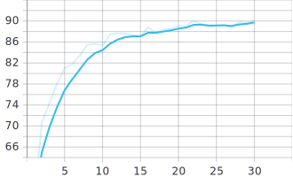

# Classfier on CIFAR-10

> 魏新鹏519021910888，张思鹏519021910957

## 数据预处理

根据官网的介绍，CIFAR-10数据集由60000张32*32 3通道的图片组成，分成10类，每类6000张图片。一共有50000张训练图片和10000张测试图片。

我们一共采取了四种图像预处理的方法。

1. `transforms.Resize`

   在使用AlexNet训练时，因为网络的结构不满足原本的32*32输入，所以我们将图像进行了resize。

2. `transforms.RandomCrop`

   从图片中随机裁剪出尺寸为 size 的图片，如果有 padding，那么先进行 padding，再随机裁剪 size 大小的图片。

3. `transforms.RandomHorizontalFlip`

   根据概率，在水平或者垂直方向翻转图片。

4. `transforms.Normalize`

   对图像进行标准化操作。可以加速模型的收敛，均值和方差我们参考了网上其他人的使用ResNet18训练Cifar10的数据。

## 系统设计

### 模型设计

我们一共使用了三种网络结构，LeNet[1]，AlexNet[2]和ResNet[3]。

最终我们采用了18层的ResNet结构，具体结构如下。

模型一共有18层。

首先是第一步卷积层，将输入的32x32x3的图片用64个3x3的卷积核进行卷积。

其次是4个BasicBlock，每个BasicBlock里面有4层卷积，每两层卷积之间有一次残差连接(residual connection), 每隔一个BasicBlock卷积核的个数逐步升高。

最后是一层全连接层，进行一个线性变换将输出的512个feature map映射为10维的向量，对应于10个分类。

### 训练方法

## 实验结果

### 训练过程

我最初在自己的PC上训练，因为本人的MacBook没有独显，所以只能使用CPU训练。LeNet还勉强可以计算，当使用AlexNet后一个晚上也只能完成两个epoch，于是我开始使用Kaggle提供的GPU进行训练。我们AlexNet的训练全部是在kaggle上进行的。但kaggle的GPU每周有限时，且一次只能训练一个模型，后来使用ResNet18后单个模型的训练时长大大增加，于是我求助于一位AI试点班的同学，他向我提供了充足的计算资源，特此感谢。

由于pytorch优秀的封装，使用CUDA计算非常简单，只需要将net，data，label的数据使用`to(device)`方法传入GPU即可。

在训练过程中，我们使用tensorboard进行准确率与loss的监控。

### 调参实验及结果分析

#### AlexNet

训练集上的准确率：94.572%

测试集上的准确率：77.45%

可以看出发生了严重的过拟合，加入dropout后也有改问题。最终舍弃该模型。

#### ResNet

我一共训练了15组ResNet18。大致可以分为两个阶段，第一阶段我使用固定学习率进行训练，发现在测试集上最多只能达到90%左右的ACC。查阅资料后使用变学习率进行训练，达到了95%的ACC。

##### 第一阶段

调整的参数主要为num_workers，batch_size，learning rate，optimizer种类，optimizer中的参数，比如decay_weight，momentum等，并适当调整了ResNet的结构，比如设置shortcut为$0.8x$与$1.2x$。

| model name | train accuracy | test accuracy | learning rate | batch size | num workers | optimizer | decay_weight |
| :--------: | :------------: | :-----------: | :-----------: | :--------: | :---------: | :-------: | :----------: |
|  ResNet_1  |     99.522     |     91.8      |     0.001     |     4      |      2      |    SGD    |      0       |
|  ResNet_2  |     99.192     |     91.0      |     0.001     |     8      |      1      |   Adam    |      0       |
|  ResNet_3  |     98.76      |     90.23     |     0.005     |     4      |      1      |   Adam    |      0       |
|  ResNet_4  |     97.39      |     89.64     |     0.001     |     12     |      1      |   Adam    |      0       |
|  ResNet_5  |     96.45      |     89.55     |    0.0005     |     4      |      1      |   Adam    |      0       |
|  ResNet_6  |     97.76      |     90.21     |     0.001     |     64     |      1      |   Adam    |      0       |
|  ResNet_7  |     97.442     |     89.5      |     0.001     |    128     |      1      |   Adam    |      0       |
|  ResNet_8  |     96.452     |     87.93     |     0.01      |     64     |      1      |   Adam    |      0       |
|  ResNet_9  |     97.132     |     89.52     |     0.001     |     64     |      1      |   Adam    |     1e-8     |
| ResNet_10  |     97.622     |     89.78     |     0.001     |     64     |      1      |   Adam    |     1e-8     |

<table>
  <tr>
    <td>
 ResNet_2 test Acc
</td>
    <td>
 ResNet_2 train Acc
</td>
    <td>
 ResNet_2 training loss
</td>
  </tr>
  <tr>
    <td>
 ResNet_3 test Acc
</td>
    <td>
 ResNet_3 train Acc
</td>
    <td>
 ResNet_3 training loss
</td>
  </tr>
  <tr>
    <td>
 ResNet_4 test Acc
</td>
    <td>
 ResNet_4 train Acc
</td>
    <td>
 ResNet_4 training loss
</td>
  </tr>
  <tr>
    <td>
 ResNet_5 test Acc
</td>
    <td>
 ResNet_5 train Acc
</td>
    <td>
 ResNet_5 training loss
</td>
  </tr>
  <tr>
    <td>
 ResNet_6 test Acc
</td>
    <td>
 ResNet_6 train Acc
</td>
    <td>
 ResNet_6 training loss
</td>
  </tr>
  <tr>
    <td>
 ResNet_7 test Acc
</td>
    <td>
 ResNet_7 train Acc
</td>
  </tr>
  <tr>
    <td>
 ResNet_8 test Acc
</td>
    <td>
 ResNet_8 train Acc
</td>
    <td>
 ResNet_8 training loss
</td>
  </tr>
  <tr>
    <td>
 ResNet_9 test Acc
</td>
    <td>
 ResNet_9 train Acc
</td>
    <td>
 ResNet_9 training loss
</td>
  </tr>
  <tr>
    <td>
 ResNet_10 test Acc
</td>
    <td>
 ResNet_10 train Acc
</td>
    <td>
 ResNet_10 training loss
</td>
  </tr>
  <tr>
    <td>
 ResNet_11 test Acc
</td>
    <td>
 ResNet_11 train Acc
</td>
  </tr>
</table>

>1. ResNet_9将shortcut修改为$0.8x$
>
>2. 从ResNet_4开始，为了加快训练。将epoch改为30，train和test的准确率都是30个epoch时的结果。

可以观察到，batch_size 64和128相比4效果更好，Adam优化器设置decay_weight可以加快训练。

但是也注意到无论如何调整参数，准确率也只是在90%起伏，于是开始寻找是不是能有一些显著提升的办法。

##### 第二阶段

其实之所以从ResNet_4开始将epoch设置为30是因为我观察到从30个epoch之后准确率提升并不大，进入了一个平台。经过查阅资料，得知固定学习率是不可取的，应当在训练了一定的epoch后调整学习率。这个道理其实很简单，学习率是每次梯度更新的步长，随着时间的推移降低学习率往往是有益的。在训练网络时，我们试图在损失曲面中找到一些位置，网络可以获得更高的准确率。如果我们不断保持高学习率，我们可能会overshoot这些低loss的区域，因此我们应当在当loss进入plateau后降低学习率使我们的网络能够下降到“更优化”的loss landscape区域。

我采用了两种更新学习率的方式。

1. 根据第一阶段训练得到的曲线，使用`optim.lr_scheduler.MultiStepLR`，在epoch为30，60，80时将学习率乘以10%。最终100个epoch在测试集上可以达到94.32%的ACC。结果如下：

   <table>
     <tr>
       <td>
 ResNet_12 test loss
</td>
       <td>
 ResNet_12 train loss
</td>
     </tr>
     <tr>
       <td>
 ResNet_12 test Acc
</td>
       <td>
 ResNet_12 train Acc
</td>
     </tr>
   </table>

2. 使用`optim.lr_scheduler.CosineAnnealingLR`，通过余弦退火的方式每个epoch更新学习率。

   学习率更新曲线如下：

   

   我设置T_max参数分别训练了100和200个epoch。分别可以达到95.07%和95.42%的准确率。

   200个epoch。

   <table>
     <tr>
       <td>
 ResNet_13 test loss
</td>
       <td>
 ResNet_13 train loss
</td>
     </tr>
     <tr>
       <td>
 ResNet_13 test Acc
</td>
       <td>
 ResNet_13 train Acc
</td>
     </tr>
   </table>

   100个epoch。

   <table>
     <tr>
       <td>
 ResNet_14 test loss
</td>
       <td>
 ResNet_14 train loss
</td>
     </tr>
     <tr>
       <td>
 ResNet_14 test Acc
</td>
       <td>
 ResNet_14 train Acc
</td>
     </tr>
   </table>

## 讨论与思考

残差网络最重要的贡献是发现了存在的退化现象(model degradation), 并尝试了一种可行的解决方案，也即加入残差连接。[3]中指出，假设有一个训练足够好的模型，在后面增加更多的层数都做Identity map，那么模型的准确率理论上不会降低，所以文献中直接取值残差连接为$x$，也就是Identity map，但在训练过程中发现将残差连接的系数设置为$0.8x,2x$等，并不会大幅度降低准确率，说明问题不能单纯从加入Identity map解释，实际结果是和系数为$x$的准确率十分相近，由此猜测假设残差连接存在一个最优残差函数(不必是$k\cdot x$的形式，也可能是一些更复杂的函数)。

## 参考文献

[1] Y. Lecun, L. Bottou, Y. Bengio and P. Haffner, "Gradient-based learning applied to document recognition," in Proceedings of the IEEE, vol. 86, no. 11, pp. 2278-2324, Nov. 1998, doi: 10.1109/5.726791.

[2] Krizhevsky, Alex, Ilya Sutskever, and Geoffrey E. Hinton. "Imagenet classification with deep convolutional neural networks." *Advances in neural information processing systems* 25 (2012): 1097-1105.

[3] He, Kaiming, et al. "Deep residual learning for image recognition." *Proceedings of the IEEE conference on computer vision and pattern recognition*. 2016.