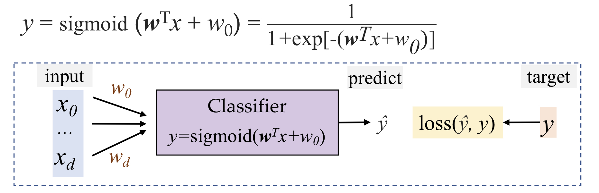
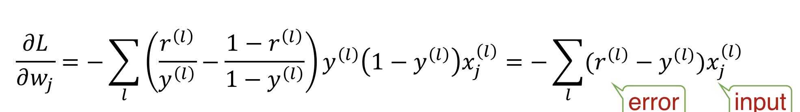
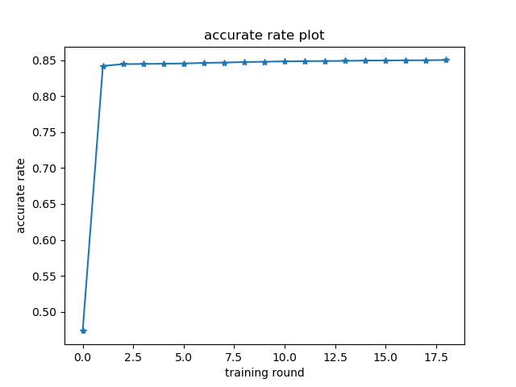
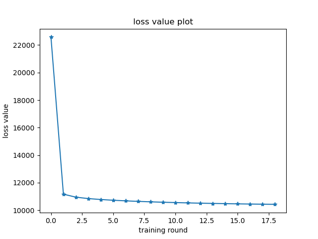
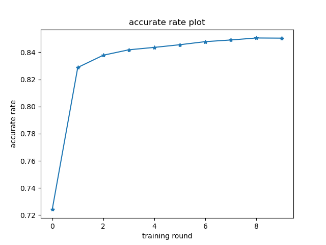
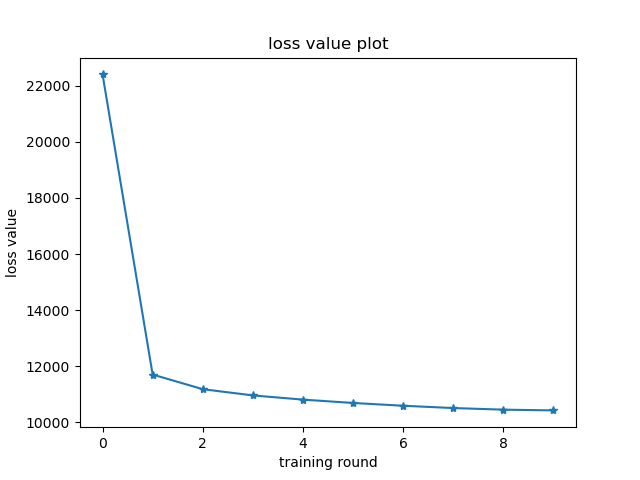

# lab1 report

## logistic regression

### implementation

#### code

```python
# initiate parameter with random values
w = np.random.rand(feature_size + 1)
w *= 0.02
w -= 0.01
# normalize train set
for feature_it in x_test_set.T:
    max_value = feature_it.max()
    if max_value != 1 and max_value != 0:
        feature_it /= max_value
# begin training and update parameter
# put code below in loops
delta_w = np.zeros(feature_size + 1)
y = sigmoid(x_train_set @ w[1:] + w[0])
delta_w[1:] = (y_train_set - y) @ x_train_set
delta_w[0] = (y_train_set - y).sum()
w += eta * delta_w
```

#### explanation

逻辑斯蒂回归的模型如下图所示：



输入x，维度为feature的数量，w为参数，维度与x相同，经过sigmoid函数计算得到预测值，损失函数为$L(w,w_0|D) = -\sum_{l=1}^Nr^{(l)}\log y^{(l)}+(1-r^{(l)})\log (1-y^{(l)})$

使用梯度下降对其进行优化，如下图所示



$w_{t+1}=w_t-\eta_t\frac{\partial L}{\partial w}$

调整不同的初始值与学习率，反复迭代即可。

### evaluation matrics

```python
# x_test_set and y_test_set are data read from X_test.csv and Y_test.csv
y = sigmoid(w[1:] @ x_test_set[i] + w[0])
for i in range(test_size):
    y = sigmoid(w[1:] @ x_test_set[i] + w[0])
    if y > 0.5:
        result = 1.0
    else:
        result = 0.0
    if result == y_test_set[i]:
        accurate_count += 1
accurate_rate = accurate_count / test_size
```

使用准确率作为模型的评价标准。

### test

> 每训练500轮计算一次train和test的集合的准确率，与当前损失函数的值。
>
> 当两次test集合的准确率相差小于0.001认为收敛，并将该值作为模型的最终准确率。
>
> 统计训练轮数与运行时间。

|  参数初始区间  | 学习率  | 训练轮数 | 测试集准确率 | 训练时间 |  损失值   |
| :------------: | :-----: | :------: | :----------: | :------: | :-------: |
| $[-0.01,0.01]$ | 0.00005 |   9000   |    85.02%    |  23.1s   | -10424.82 |





|  参数初始区间  | 学习率 | 训练轮数 | 测试集准确率 | 训练时间 |  损失值   |
| :------------: | :----: | :------: | :----------: | :------: | :-------: |
| $[-0.01,0.01]$ | 0.0001 |   4500   |    85.04%    |  12.4s   | -10422.24 |





## Naive Bayes

我使用了四种sklearn中的Naive Bayes算法：GaussianNB, MultinomialNB, BernoulliNB, ComplementNB。

使用train中的数据集进行训练，使用test中的数据集进行检验，将正确率作为evaluation matrics。

|     模型      | 测试集准确率 |
| :-----------: | :----------: |
|  GaussianNB   |    79.53%    |
| MultinomialNB |    78.51%    |
|  BernoulliNB  |    77.44%    |
| ComplementNB  |    78.51%    |

## Compare & Analyze

根据我选取的evaluation matrics，即模型在测试集上的准确率，逻辑斯蒂回归的效果要好于朴素贝叶斯。

这是因为逻辑斯蒂回归使用梯度下降进行了非常多轮的训练，而朴素贝叶斯没有训练直接根据数据计算参数，所以逻辑斯蒂回归更能准确的刻画数据特征。